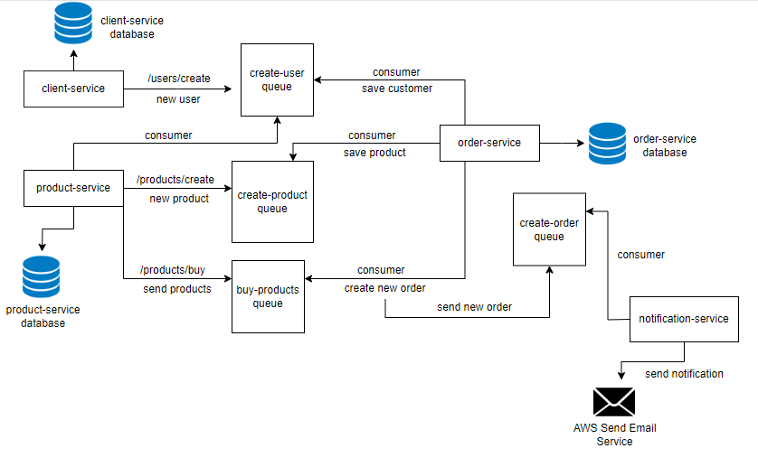

# E-commerce Microservice

## Apresentação do projeto

## Arquitetura:

### Dividi a arquitetura dessa forma, para trazer uma organização melhor para a aplicação, separando-a por camadas

#### **Domain:**

A camada central e mais interna da aplicação é onde são definidas as regras de negócio, entidades e interfaces.

#### **Presentation:**

Essa camada é responsável pela interação com requisições externas, sendo a porta de entrada para os efeitos de um usuário, aplicativo ou uma mensagem terão no domínio da aplicação. Aqui, as solicitações são aceitas e as respostas são moldadas antes de serem exibidas ao usuário.

#### **Data:**

Camada responsável por implementar os protocolos dos casos de uso presentes na camada de domínio, nela são injetados os repositórios vindos da camada de infra para realizar a comunicação com banco de dados.

#### **Infra:**

Esta camada é a que acessa serviços externos, como banco de dados, sistemas de mensagens e serviços de e-mail.

## Serviços:

- Client Service

- Product Service

- Order Service

- Notification Service

## Tecnologias Utilizadas:

- NodeJS
- Typescript
- NestJS
- Prisma
- PostgreSQL
- Redis
- Docker
- Swagger
- Aws Send Email Service (AWS SES)
